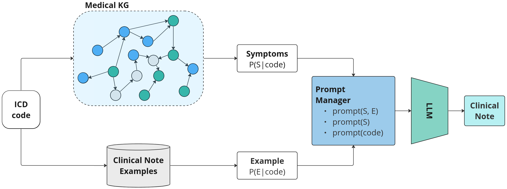
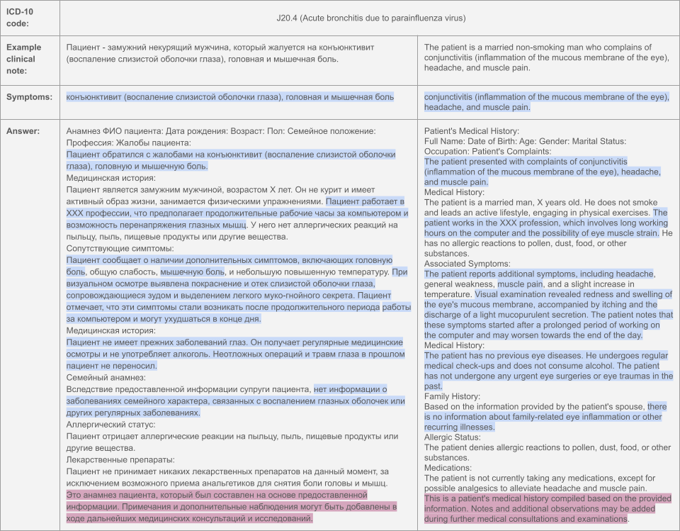
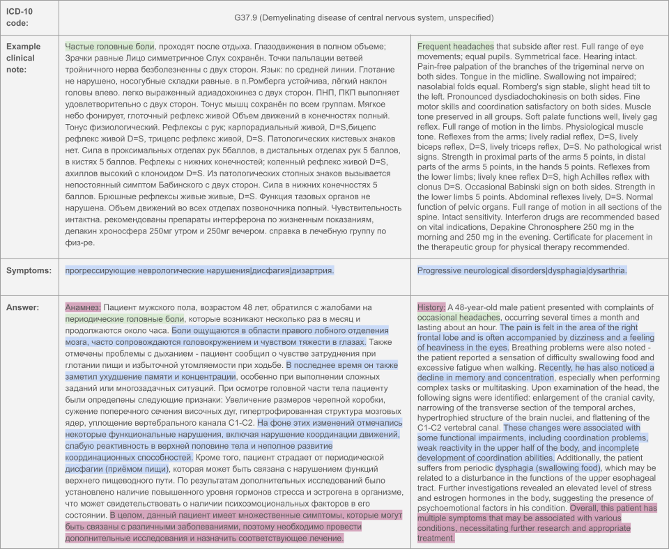

# MedSyn: LLM-based Synthetic Medical Text Generation Framework



The repository contains modules for generating clinical notes in Russian based on the target ICD-10 code. <br>
The proposed framework utilizes symptoms sampled from a medical knowledge graph and real clinical note examples for a target ICD code. <br>
Generating clinical notes without prior data is possible, but results may differ from those presented in the paper. <br>


## Data for instruction fine-tuning:
We provide all the collected data and data prepared for instruction fine-tuning. To access the data, download it from the [link](https://drive.google.com/drive/folders/1nElrx-pG2WXxdjZW_oYx4tHsWvUkarJy?usp=sharing):

* `datasets.zip` - collected datasets
* `data_ift.zip` - datasets processed in instruction fine-tuning format

Each sample in the instruction fine-tuning dataset is represented as: 
```json
   {
      "instruction": "Some kind of instruction.",
      "input": "Some prior information.",
      "output": "Desirable output."
   }
```

#### Data sources:
| Data | Number of samples | Number of created samples | Description |
| :---   | :--- | :--- | :--- |
| Almazov anamneses   | 2356 | 6861 | Set of anonymized EMRs of patients with acute coronary syndrome (ACS) from Almazov National Medical Research Centre.
| Diagnosis data  | 286 | 286 | Diagnosis data that contains a description of the diagnosis and corresponding symptoms.
| Diseases data | 2945 | 4890  | Diseases data includes a description of diseases and their symptoms from Wikipedia.
| GPT-3.5 data | 11480 | 11480 | Clinical notes generated with GPT-3.5 based on disease-relevant symptoms.
| GPT-4 data with symptoms | 5006 | 5006  | Clinical notes generated with GPT-4 based on disease-relevant symptoms.
| ISA anamneses  | 161 | 483 | Set of large fragments of patients’ anamnesis from Research Institute of the Russian Academy of Sciences.
| MedElement | 1741 |  1741 | Pairs of the abbreviation and its definition from the [MedElement](https://medelement.com/) portal.
| Medical QA | 10937 | 10937  | Q&A posts from a [medical-related forum](https://huggingface.co/datasets/blinoff/medical_qa_ru_data)
| MedSpellcheck | 1054 | 1054  | MedSpellcheck benchmark contains pairs of a sentence that may contain spelling errors and corresponding correction.
| Medical Knowledge Graph | 13582 |  6000 | Complex instructions with descriptions of diseases, drugs, and symptoms, extracted from the MKG.
| MSD Manual | 162 | 1789  | Set of detailed descriptions of diseases and associated symptoms from [MSD Manuals](https://www.msdmanuals.com/).
| RuMedDaNet | 1564 | 1564  | Q&A pairs in the range of medical-related domains (pharmacology, anatomy, therapeutic medicine, etc).
| RuMedNLI | 12627 | 12627 | NLI task in the clinical domain, full translated counterpart of MedNLI data.
| RuMedPrime | 7625 | 33465  | Anonymized medical anamneses of SSMU hospital visitors.
| RuMedTest SOGMA | 770 |  355 | RuMedTest is a 5-question test on different medical fields (gastroenterology, cardiovascular diseases, etc.).
| In-house clinical notes | 9024 | 19719  | Set of anonymized in-house patient clinical notes.
| WikiMed | 13324 | 33951  | Set of descriptions of diseases and drug names from [WikiMed](http://wikimed.pro).


            
  

## Synthetic dataset:
Generated synthetic datasets containing 41,185 samples spanning 219 ICD-10 codes can be downloaded via the [link](https://drive.google.com/drive/folders/1nElrx-pG2WXxdjZW_oYx4tHsWvUkarJy?usp=sharing). <br>

`full-dataset-scored-anaon.csv`

| Data field | Description    |
| :---   | :--- |
| idx | Unique sample identifier. |
| ICD-10 | The targeted ICD-10 code used for prior data sampling. |
| generation_model | The model used for sample generation (GTP-3.5, GPT-4, LLaMA-7b, LLaMA-13b) |
| prompt | Prompt used for sample generation. |
| prior | Type of prior data used for sample generation. |
| example | Bool variable for the presence or absence of example during generation. |
| example | source Source of example (open-source RuMedPrime or private medical data). |
| response | Result of model generation. |
| symptoms | Symptoms used for prompt creation. |
| anamnesis | Clinical note example used as a style example in the prompt. |
| symptoms_recall | BERT-score for response and symptoms. |
| anamnesis_precision | BERT-score for response and anamnesis |


Part of real in-house clinical notes was hidden and replaced with `private_data` mark. <br>
Thirty samples from private real data were completely anonymized (by humans) and preserved in the dataset.

### Examples:
GPT-4 generation example:


LLaMA-7b generation example:



## Fine-tuned LLaMA-7b:
We provide a fine-tuned LLaMA-7b model checkpoint; it can be downloaded via the [link](https://drive.google.com/drive/folders/1nElrx-pG2WXxdjZW_oYx4tHsWvUkarJy?usp=sharing).

## Citation:
